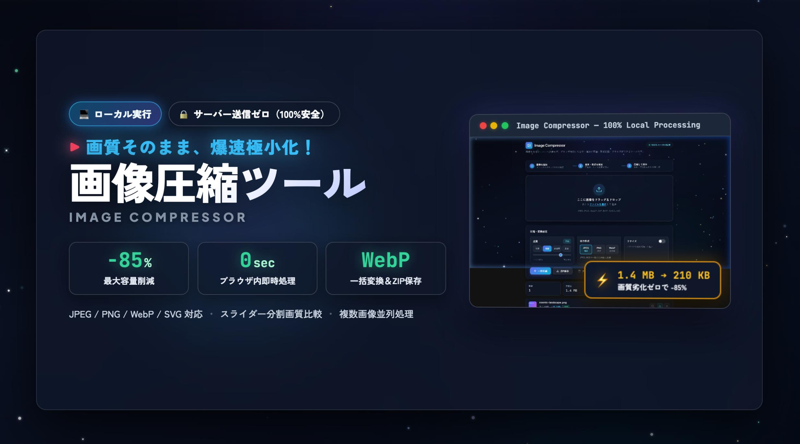
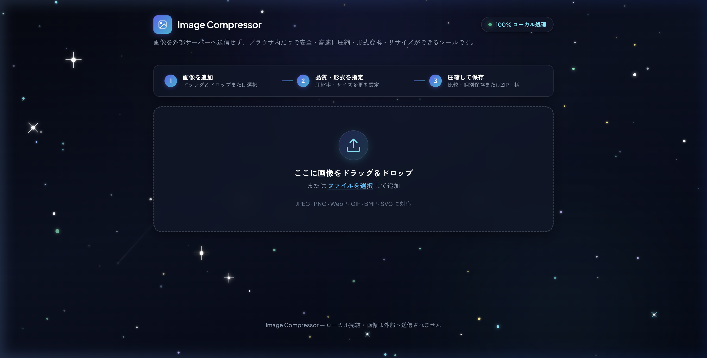
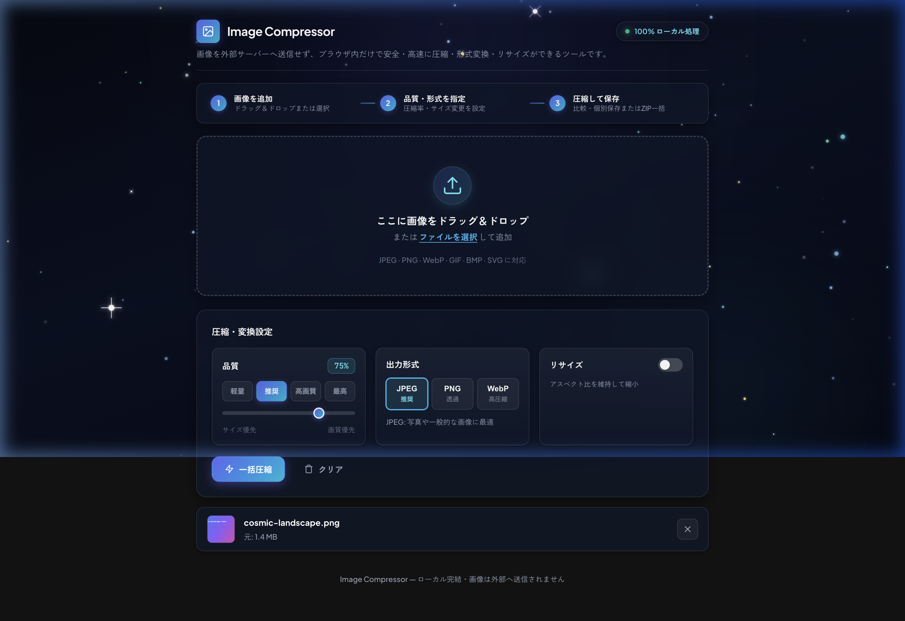
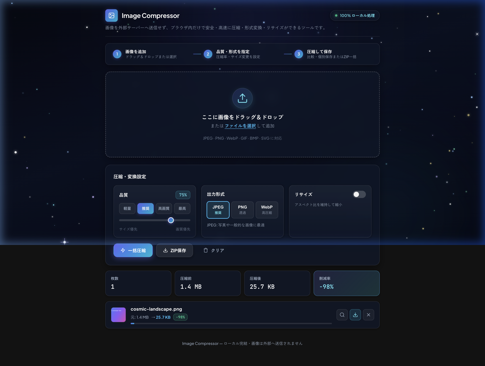

# Image Compressor

高速・高品質な画像圧縮をブラウザだけで完結させるWebツールです。  
すべての処理はクライアントサイド（ブラウザ内）で実行されるため、画像データが外部サーバーに送信されることはありません。

[](https://youtu.be/VUSyXU91hOM)

▶️ **[YouTubeで動画を見る（https://youtu.be/VUSyXU91hOM）](https://youtu.be/VUSyXU91hOM)**

---

## 目次

- [機能一覧](#機能一覧)
- [対応フォーマット](#対応フォーマット)
- [利用手順](#利用手順)
- [起動方法](#起動方法)
- [プロジェクト構成](#プロジェクト構成)
- [技術スタック](#技術スタック)
- [プライバシーとセキュリティ](#プライバシーとセキュリティ)

---

## 機能一覧

| 機能 | 詳細 |
| --- | --- |
| ドラッグ＆ドロップ | ファイルをブラウザウィンドウに直接ドロップして素早く読み込み |
| 複数ファイル一括処理 | 複数の画像ファイルをまとめて追加・並列圧縮 |
| 品質調整 | スライダーで 1〜100% の圧縮品質を細かく指定 |
| プリセット選択 | 軽量(50%) / 推奨(75%) / 高画質(85%) / 最高(95%) のワンクリック指定 |
| フォーマット変換 | JPEG / PNG / WebP への相互変換出力に対応 |
| リサイズ | 最大幅・最大高の指定およびアスペクト比維持リサイズ（プリセット付き） |
| 圧縮前後比較 | スライダースプリットビューによる視覚的な画質比較 |
| 一括ダウンロード | 圧縮済み画像群を ZIP アーカイブとしてまとめて保存 |
| 統計サマリー | 処理枚数、元サイズ、圧縮後サイズ、削減率のリアルタイム表示 |

---

## 対応フォーマット

### 入力形式
JPEG, PNG, WebP, GIF, BMP, SVG

### 出力形式（変換先）

| フォーマット | 特徴・用途 |
| --- | --- |
| **JPEG** | 写真や高精細グラフィックに最適。高い圧縮率を実現（デフォルト） |
| **PNG** | 透過チャンネルを維持。ロスレス（可逆）圧縮 |
| **WebP** | 高い圧縮効率と透過対応を両立したウェブフォーマット |

---

## 利用手順

本ツールはシンプルな3ステップで利用できます。

### ステップ 1: 画像の追加
ドロップエリアに対象の画像ファイルをドラッグ＆ドロップするか、「ファイルを選択」ボタンをクリックして画像を追加します。複数画像の一括読み込みにも対応しています。



### ステップ 2: 品質・形式・サイズの設定
画像を追加すると設定パネルが表示されます。用途に合わせて各種パラメータを調整します。

- **品質設定**: スライダーまたはプリセットボタン（軽量: 50% / 推奨: 75% / 高画質: 85% / 最高: 95%）で圧縮率を直感的に指定します。
- **出力形式**: **JPEG**（高圧縮・一般向け）、**PNG**（透過保持・ロスレス）、**WebP**（次世代高効率フォーマット）から選択できます。
- **リサイズ（任意）**: 「リサイズ」トグルをオンにすることで、アスペクト比を維持したまま最大幅・高さを指定して縮小できます。



### ステップ 3: 圧縮の実行と保存
「一括圧縮」ボタンをクリックすると、ブラウザ上で瞬時に並列圧縮処理が行われます。

- **圧縮結果の確認**: 処理枚数、元サイズ、圧縮後サイズ、削減率（%）がリアルタイムに表示されます。
- **画質比較**: 各画像のカードにある「🔍（比較）」アイコンをクリックすると、スプリットスライダーで圧縮前後の画質差を左右比較できます。
- **個別ダウンロード**: 各画像カードのダウンロードボタンから個別に保存できます。
- **一括ダウンロード**: 「ZIP保存」ボタンをクリックすると、すべての圧縮画像を ZIP アーカイブとしてまとめて保存できます。



---

## 起動方法

本ツールは静的ファイル（HTML / CSS / JavaScript）のみで動作します。

### 起動スクリプトを使用する場合（推奨）

```bash
bash start.sh
```

Python 3 のローカルHTTPサーバー（ポート 8000）を起動し、既定のブラウザで自動的に開きます。

### 手動で起動する場合

```bash
# Python 3 を利用する場合
python3 -m http.server 8000

# Node.js (npx serve) を利用する場合
npx serve .
```

起動後、ブラウザで `http://localhost:8000` にアクセスしてください。

> **注意**  
> `file://` プロトコルで `index.html` を直接開いた場合、ブラウザのセキュリティ制限（CORS / Blob処理等）により一部機能が制限される可能性があります。必ずローカルサーバー経由でご利用ください。

---

## プロジェクト構成

```
image-compressor/
├── index.html             # メインHTML（UI構造定義）
├── style.css              # スタイルシート（CSS変数・レイアウト・コンポーネント）
├── app.js                 # アプリケーションロジック（Canvas圧縮・ZIP生成・UI制御）
├── cosmic.js              # 背景エフェクト（コズミックパーティクルアニメーション）
├── start.sh               # ローカル開発用サーバー起動スクリプト
├── image/                 # アセット画像
│   ├── samnail.jpg        # サムネイル画像
│   ├── step1.png          # 手順1: 画像追加画面
│   ├── step2.png          # 手順2: 圧縮・変換設定画面
│   └── step3.png          # 手順3: 圧縮完了・保存画面
└── Image Compressor.app/  # macOS用アプリケーションバンドル（オプション）
```

---

## 技術スタック

| ライブラリ / API | 用途 |
| --- | --- |
| **HTML5 Canvas API** | クライアントサイドでの画像描画・リサイズ・圧縮（`canvas.toBlob()`） |
| **File API / Blob API** | ファイル読み込みおよびブラウザ内オブジェクトURL生成 |
| **Drag and Drop API** | 直感的なドラッグ＆ドロップ操作によるファイル受付 |
| **JSZip (v3.10.1)** | 複数圧縮画像の一括 ZIP アーカイブ生成・保存 |
| **Google Fonts (Inter)** | モダンで視認性の高いタイポグラフィ |
| **Vanilla CSS / Vanilla JS** | 外部フロントエンドフレームワーク非依存の軽量・高速設計 |

---

## プライバシーとセキュリティ

- **完全ローカル処理**: 画像データの圧縮・変換はすべて端末上のブラウザ内で完結します。画像データが外部サーバーへ送信・保存されることは一切ありません。
- **一時メモリの解放**: 読み込まれた画像オブジェクトは処理完了後、またはタブを閉じた際にメモリ上から破棄されます。
- **外部通信**: 初回アクセス時の CDN アセット（Google Fonts および JSZip）の取得時のみ通信が発生します。
